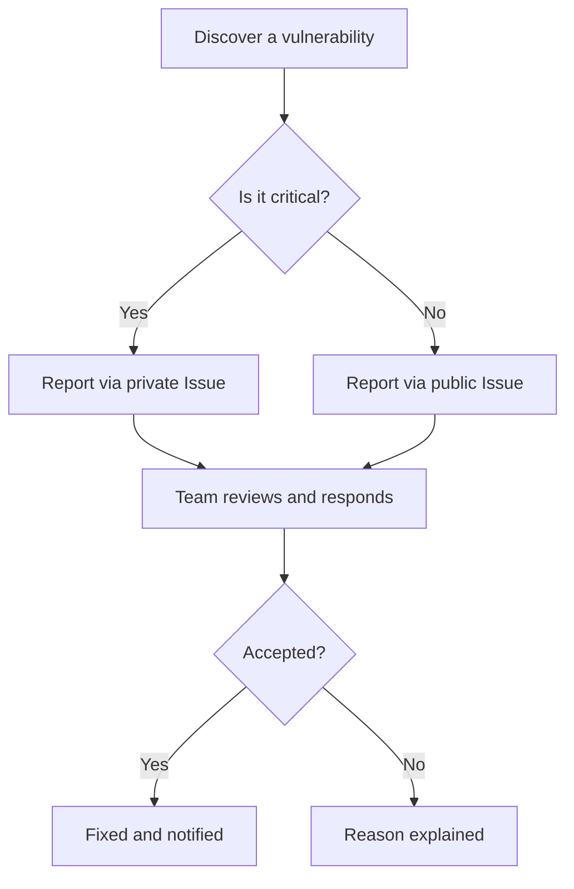

# 🛡️ Security Policy

> **⚠️ This project is under development (dev branch) and has not been tested in production.**

## 📦 Supported Versions

| Version | Status           |
| ------- | ---------------- |
| dev     | 🚧 In development|
| 5.1.x   | ✅ Supported     |
| 5.0.x   | ❌ Not supported |
| 4.0.x   | ✅ Supported     |
| < 4.0   | ❌ Not supported |

> :information_source: The `dev` version is experimental and may contain bugs. It is not recommended for production use until officially released.

---

## 🐞 Reporting a Vulnerability

If you find a vulnerability, please follow these steps:

1. Open an issue in the GitHub repository with the title `[SECURITY] Short description`.
2. Provide enough details to reproduce the issue.
3. **Do not publish public exploits or sensitive details**; the development team will contact you if more information is needed.
4. You will receive a response within **7 business days**.

If the vulnerability is accepted, you will be notified about the progress and the fix. If it is rejected, the reasons will be explained.

---

## 🤝 Contributions & Community

Contributions are welcome! You can:

- Propose security improvements
- Report bugs
- Suggest new features

To contribute, open a Pull Request or Issue following the repository's best practices.

---

Show vulnerability report flowchart

